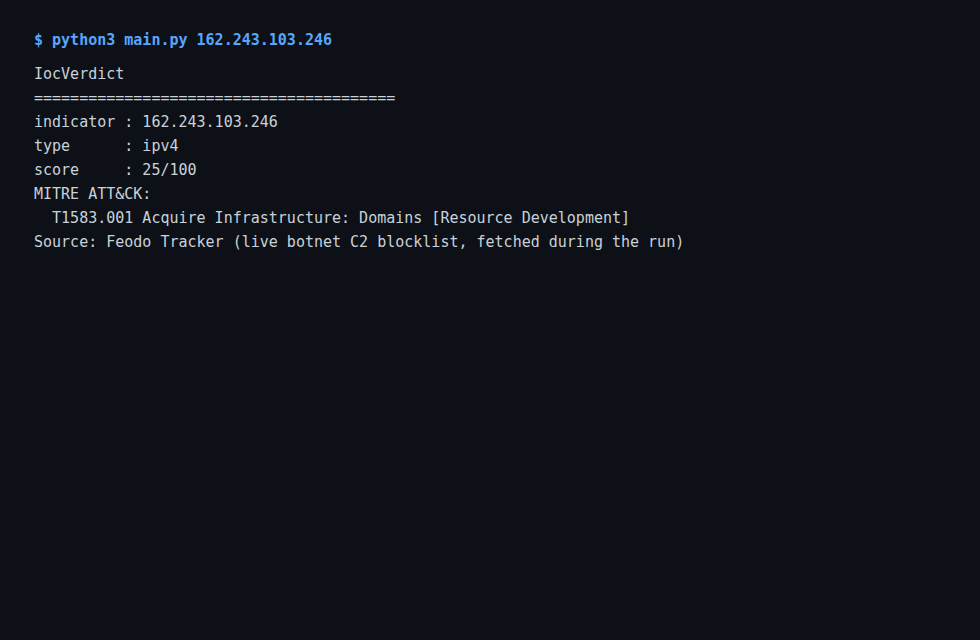
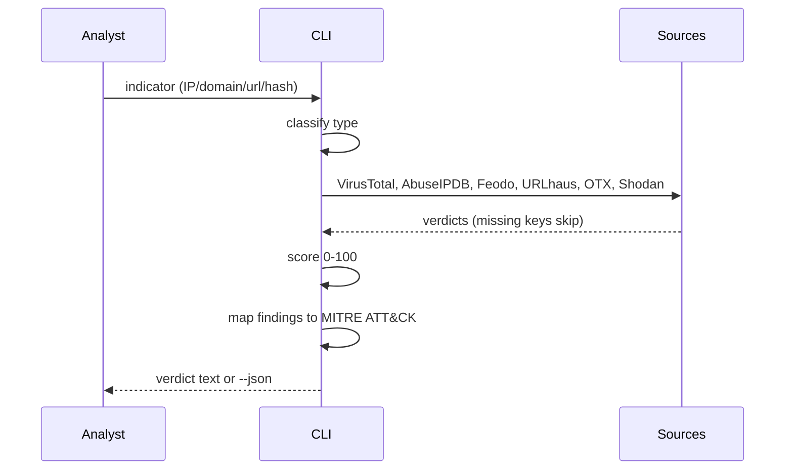

# IocVerdict

[](https://github.com/boluwajioadepojuw/IocVerdict/actions/workflows/ci.yml)

Small threat-intel console: feed it an IP, domain, URL or hash, and it asks
seven free sources what they think, folds the answers into one 0-100 score,
and maps the result onto MITRE ATT&CK.

## What it does

- classifies the indicator (ipv4/ipv6/domain/url/md5/sha1/sha256)
- queries VirusTotal, AbuseIPDB, Feodo Tracker, URLhaus, OTX, Shodan and
  MalwareBazaar (each source is optional - missing keys are skipped, the
  rest still run; MalwareBazaar's key is free from abuse.ch)
- scores 0-100 with per-source weights
- maps findings to MITRE ATT&CK techniques
- prints a compact verdict or --json output

## Running it

```bash
pip install -r requirements.txt
cp .env.example .env      # add the API keys you have
python3 main.py 8.8.8.8 paypa1.com
python3 main.py --json d41d8cd98f00b204e9800998ecf8427e
```

No keys needed to try it: without keys the lookups are skipped and the
score reflects only what the free feeds return (Feodo blocklist, URLhaus
recent-URLs CSV - cached for an hour between runs).

## Screenshot

Live run against a real C2 IP from the Feodo Tracker blocklist:



## Case study

docs/case-study.md walks a suspected C2 callback from the SIEM alert to the
final verdict, showing what each source contributed.

## Tests

The scoring and classification engine has a pytest suite (CI runs it on
Python 3.11 and 3.12):

```bash
pip install pytest
python -m pytest -q
```

## Related projects

- [SOCAtelier](https://github.com/boluwajioadepojuw/SOCAtelier) - the SOC lab whose cases surface the indicators this tool scores
- [SigScope](https://github.com/boluwajioadepojuw/SigScope) - ATT&CK coverage gate for the Sigma rules behind the detections
- [SplunkHarbor](https://github.com/boluwajioadepojuw/SplunkHarbor) - Splunk ingestion for the same endpoint telemetry
- [DomainSieve](https://github.com/boluwajioadepojuw/DomainSieve) - NRD feed to Suricata rules on the gateway
- [ArpSieve](https://github.com/boluwajioadepojuw/ArpSieve) - ARP spoofing detection on the local segment

## Author

Boluwaji Oluwaseyi Adepoju

## Flow


